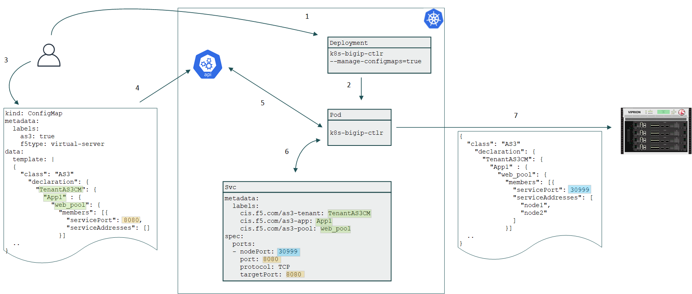

# AS3 ConfigMap

## Diagram

## High-level Flow

1. Admin creates CIS Deployment to manage ConfigMap
2. Kubernetes creates CIS Pod which will monitor the API server
3. Admin creates ConfigName containing the full AS3 declaration

    * Tenant, Application, and Pool names matching the labels of existing Service
    * Backend Service port
  

4. ConfigMap definition is pushed to Kubernetes API
5. CIS Pod detects new ConfigMap
6. CIS Pod combines the new ConfigMap with the existing NodePort Service

    * Matches the labels with ConfigMap data
    * Matches the Service port
    * Looks up the nodePort
  

7. CIS Pod composes AS3 declaration to be pushed to BIG-IP

    * Most parts remain as in ConfgMap declaration
    * Pool
      * Member service addresses are Kuberenetes nodes
      * Member service port is NodePort of the Service