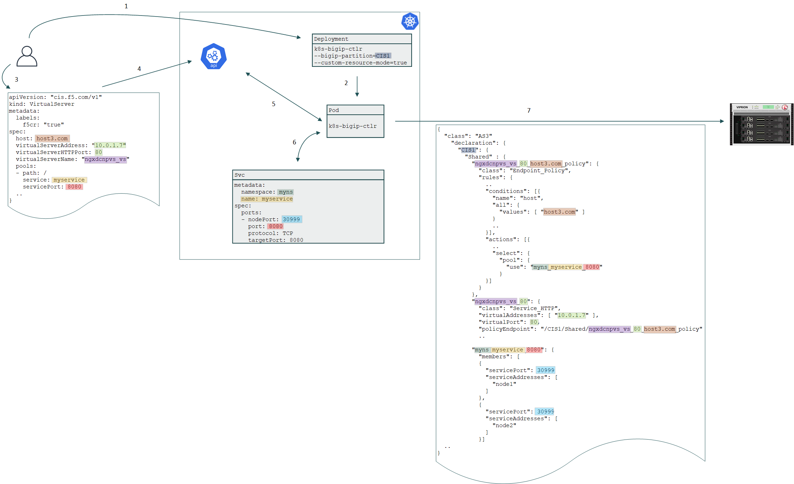

# Custom Resource Definition (CRD)

## Diagram

## Steps

1. Admin creates CIS Deployment with BIG-IP Partition name to manage and CRD enabled
2. Kubernetes creates CIS POD which will monitor the API server
3. Admin creates VS CRD definition with the following details

    * Hostname of the front-end VS
    * VS IP address and port
    * VS name
    * Backend Service name
    * Backend Service port
  

4. CRD is pushed to Kubernetes API
5. CIS POD detects new CRD
6. CIS POD combines the new CRD with the existing NodePort Service

    * Looks up the Namespace of the Service
    * Matches the Service name
    * Matches the Service port
    * Looks up the nodePort
  

7. CIS POD composes AS3 declaration to be pushed to BIG-IP

    * Tenant name is the BIG-IP Partition in CIS definition
    * Endpoint Policy
      * Name is composed of CRD information: VS name, VS port, and Hostname
      * Rule to match Hostname
      * Action to select the AS3 Pool
    * Service HTTP VS
      * Name is composed of VS name and port
      * IP address and port as defined in CRD
      * Pointer to AS3 Endpoint Policy
    * Pool
      * Member service addresses are Kuberenetes nodes
      * Member service port is NodePort of the Service