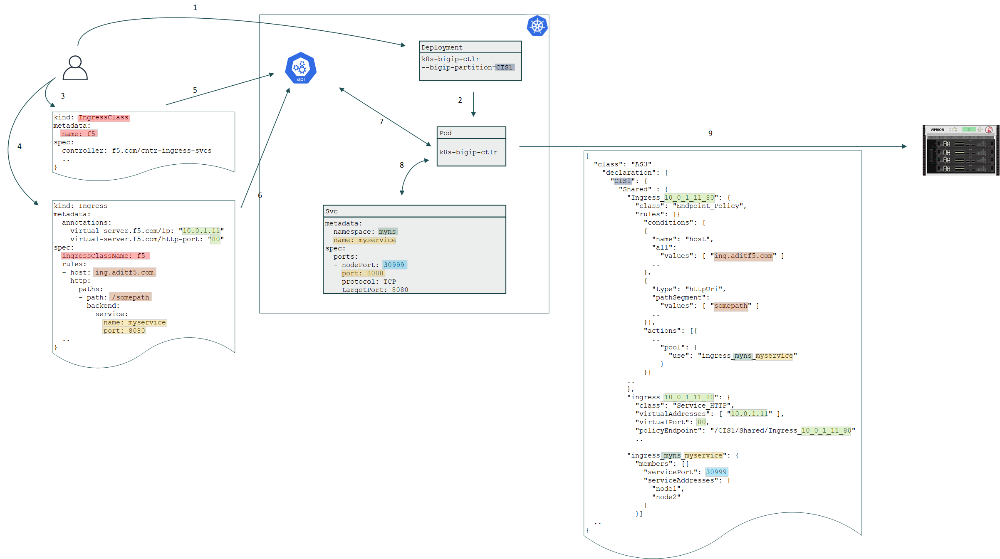

# Ingress

## Diagram

## High-level Flow

1. Admin creates CIS Deployment with BIG-IP Partition name to manage
2. Kubernetes creates CIS POD which will monitor the API server
3. Admin creates IngressClass with specific name
4. Admin creates Ingress definition

    * Annotations contain VS IP address and port
    * Rules
      * Hostname of the front-end VS
      * URL Path
    * Backend Service name
    * Backend Service port
  

5. IngressClass definition is pushed to Kubernetes API
6. Ingress definition is pushed to Kubernetes API
7. CIS POD detects new Ingress
8. CIS POD combines the new Ingress with the existing NodePort Service

    * Looks up the Namespace of the Service
    * Matches the Service name
    * Matches the Service port
    * Looks up the nodePort
  

7. CIS POD composes AS3 declaration to be pushed to BIG-IP

    * Tenant name is the BIG-IP Partition in CIS definition
    * Endpoint Policy
      * Name is composed of Ingress annotations: VS name and VS port
      * Rule to match Ingress definition: Hostname and URL path
      * Action to select the AS3 Pool
    * Service HTTP VS
      * Name is composed of Ingress annotations: VS name and VS port
      * IP address and port as declared in Ingress annotations
      * Pointer to AS3 Endpoint Policy
    * Pool
      * Member service addresses are Kuberenetes nodes
      * Member service port is NodePort of the Service